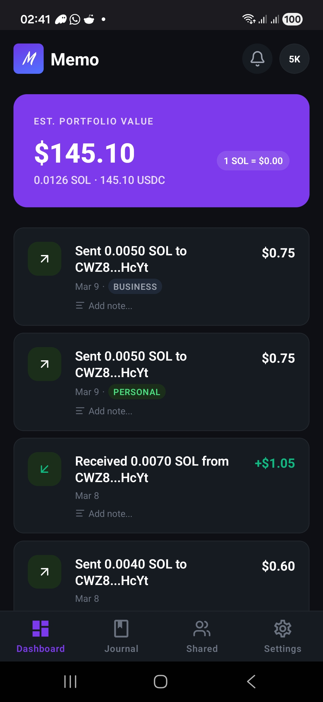
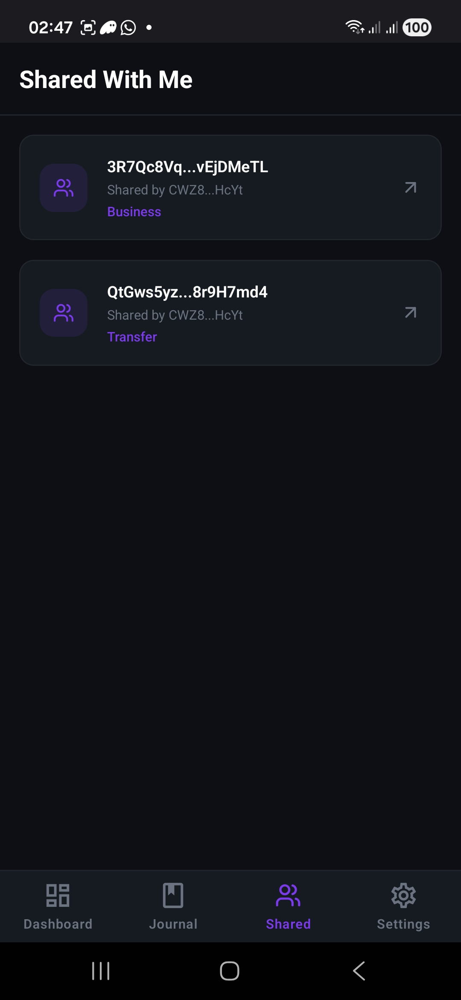
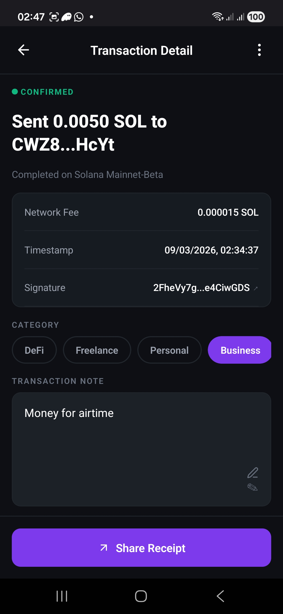

# Memo — Solana Transaction Journal

Memo is a personal finance journal for your Solana wallet. It lets you annotate, categorize, and notarize your on-chain transactions — turning raw blockchain data into a meaningful, auditable financial record.

---

## Download & Test

[Download APK (v1.0.0-beta)](https://github.com/AdemolaSam/memo/releases/latest)

---

**Requirements:**

- Android device with Phantom wallet installed
- Enable "Install from unknown sources" in Android settings
- Solana mainnet wallet with some transaction history

## The Problem

Solana transactions are cryptic. A DeFi power user making 50+ transactions a month has no way to remember what each one was for, no way to prove a payment happened without sharing their entire wallet history, and no accounting-ready export for tax season.

---

## The Solution

Memo sits on top of your Solana wallet and gives every transaction a human layer:

- **Plain-English descriptions** powered by Helius Enhanced Transactions API
- **Private annotations** — add notes and categories, encrypted on your device
- **On-chain notarization** — write a tamper-proof SHA-256 hash of your note to the Solana Memo Program, proving it existed at a specific block timestamp
- **Auditor sharing** — share specific transactions with accountants or auditors via wallet-based access control, without exposing your full history
- **Accounting export** — CSV export with transaction date, category, amount, fee, and notarization status
- **Push notifications** — get prompted to annotate immediately after a transaction lands

---

<table>
  <tr>
    <td align="center">
      
    </td>
    <td align="center">
      
    </td>
    <td align="center">
      
    </td>
    <td align="center">
      
    </td>
  </tr>
</table>

## Architecture

```
┌─────────────────────────────────────────────────────┐
│                  Mobile App (Expo)                   │
│  React Native + Solana Mobile Stack + TanStack Query │
└────────────────────┬────────────────────────────────┘
                     │ HTTPS + JWT
┌────────────────────▼────────────────────────────────┐
│               Backend (Node.js/Express)              │
│         Prisma ORM + Supabase (Postgres)             │
└──────┬──────────────────────┬───────────────────────┘
       │                      │
┌──────▼──────┐     ┌─────────▼──────────┐
│  Helius API  │     │   Solana Mainnet   │
│ Transactions │     │   Memo Program     │
│  + Webhooks  │     │  (Notarization)    │
└─────────────┘     └────────────────────┘
```

---

## Key Features

### 🔐 End-to-End Encrypted Annotations

Notes are encrypted using NaCl box encryption before leaving your device. The encryption keypair is derived from your wallet signature — meaning it's always recoverable from your seed phrase, never stored on our servers.

### 🛡 On-Chain Notarization

When you notarize a note, the SHA-256 hash of your plaintext is written to the Solana Memo Program. This proves:

- The note existed at a specific block timestamp
- The note hasn't been tampered with since
- Without revealing the note content itself

### 👥 Auditor Sharing

Add specific wallet addresses as viewers for a transaction. Each viewer receives a re-encrypted copy of the narration — only they can decrypt it. Remove access at any time.

### 📊 Accounting Export

Export annotated transactions as a CSV with:

- Transaction date and narration date
- Human-readable description
- Category, amount, fee
- Notarization status and on-chain proof hash

### 🔔 Push Notifications

Helius webhooks trigger instant push notifications when your wallet receives a transaction, prompting you to annotate while the context is fresh.

---

## Tech Stack

### Mobile

| Package                   | Purpose                        |
| ------------------------- | ------------------------------ |
| Expo + EAS Build          | Build system                   |
| Solana Mobile Stack (MWA) | Wallet connection + signing    |
| @tanstack/react-query     | Server state + infinite scroll |
| tweetnacl                 | NaCl encryption                |
| expo-notifications        | Push notifications             |
| react-native-view-shot    | Receipt image capture          |
| lucide-react-native       | Icons                          |
| react-native-qrcode-svg   | QR codes on receipts           |

### Backend

| Package                            | Purpose                        |
| ---------------------------------- | ------------------------------ |
| Express + TypeScript               | API server                     |
| Prisma + Supabase                  | ORM + Postgres database        |
| Helius SDK                         | Transaction parsing + webhooks |
| @solana/web3.js + @solana/spl-memo | On-chain notarization          |
| expo-server-sdk                    | Push notification delivery     |
| jsonwebtoken + tweetnacl           | Auth + signature verification  |

---

## How It Works

### Authentication

```
Connect Wallet (MWA)
      ↓
Backend issues nonce challenge
      ↓
User signs message in Phantom
      ↓
Backend verifies nacl signature
      ↓
JWT issued — valid 7 days
```

### Encryption

```
User signs deterministic message "memo-encryption-key-v1"
      ↓
First 32 bytes of signature used as NaCl keypair seed
      ↓
Keypair cached in memory for session
      ↓
Notes encrypted with NaCl box before API call
      ↓
Decrypted client-side on display
```

### Notarization

```
User writes a note → taps Notarize
      ↓
SHA-256(plaintext) computed on device
      ↓
Hash sent to backend (plaintext never leaves device)
      ↓
Backend writes JSON memo to Solana Memo Program:
{"app":"memo","hash":"<sha256>","ref":"<txHash>"}
      ↓
Memo transaction signature stored in DB
      ↓
Anyone can verify by hashing the note and comparing
```

---

## API Endpoints

### Auth

| Method | Endpoint              | Description                   |
| ------ | --------------------- | ----------------------------- |
| POST   | `/api/auth/challenge` | Get nonce for wallet signing  |
| POST   | `/api/auth/verify`    | Verify signature, receive JWT |

### Transactions

| Method | Endpoint                                       | Description                       |
| ------ | ---------------------------------------------- | --------------------------------- |
| GET    | `/api/transactions`                            | List transactions with pagination |
| GET    | `/api/transactions/:signature`                 | Single transaction with narration |
| POST   | `/api/transactions/:signature/narration`       | Save narration                    |
| PUT    | `/api/transactions/:signature/narration`       | Update narration                  |
| POST   | `/api/transactions/:signature/notarize`        | Write hash to Solana              |
| POST   | `/api/transactions/:signature/viewers`         | Add auditor viewer                |
| DELETE | `/api/transactions/:signature/viewers/:wallet` | Remove viewer                     |

### Export & Webhooks

| Method | Endpoint                  | Description                |
| ------ | ------------------------- | -------------------------- |
| GET    | `/api/export`             | Download CSV               |
| POST   | `/api/webhook/helius`     | Helius transaction webhook |
| POST   | `/api/webhook/push-token` | Register device push token |

---

## Database Schema

```prisma
User         — wallet address, push token, JWT nonce
Narration    — encrypted text, category, notarized flag
Notarization — memo tx hash, narration hash (SHA-256)
Viewer       — viewer wallet, re-encrypted text
```

---

## Setup

### Prerequisites

- Node.js 18+
- Android device with Phantom wallet installed
- Helius API key (helius.dev)
- Supabase project
- Expo account + EAS CLI

### Backend

```bash
git clone https://github.com/AdemolaSam/memo-backend
cd memo-backend
npm install

# create .env
cp .env.example .env
# fill in: DATABASE_URL, HELIUS_API_KEY, JWT_SECRET,
#          WEBHOOK_SECRET, BACKEND_KEYPAIR_SECRET,
#          SOLANA_RPC_URL, WEBHOOK_URL

npx prisma generate
npx prisma migrate deploy
npm run dev
```

### Mobile

```bash
git clone https://github.com/AdemolaSam/memo
cd memo
yarn install

# install EAS CLI
npm install -g eas-cli
eas login

# build for Android
npx eas build --profile development --platform android --local

# install on device
adb install build-*.apk

# start Metro
yarn start
```

---

## Environment Variables

### Backend (.env)

```env
DATABASE_URL=postgresql://...supabase...
HELIUS_API_KEY=your_helius_key
JWT_SECRET=your_jwt_secret
JWT_EXPIRATION=7d
SOLANA_RPC_URL=https://mainnet.helius-rpc.com/?api-key=YOUR_KEY
WEBHOOK_URL=https://your-backend.onrender.com/api/webhook/helius
WEBHOOK_SECRET=your_webhook_secret
BACKEND_KEYPAIR_SECRET=base64_encoded_keypair_secret_key
```

---

## Security Notes

- All narration text is encrypted client-side before reaching the backend
- The backend never sees plaintext narration content
- Encryption keys are derived from wallet signatures — recoverable via seed phrase
- JWT tokens expire after 7 days
- Webhook endpoint secured with `Authorization: Bearer` header verification

### Known Limitations (Beta)

- Notarization transactions are currently signed by a backend proxy keypair. Production will use MWA for users to sign and pay directly from their wallet
- Encryption keypair is cached in memory per session — Phantom prompts once per app session for the derivation signature
- Push notifications require FCM setup via Firebase console

---

## Business Model

| Tier     | Price     | Features                                             |
| -------- | --------- | ---------------------------------------------------- |
| Free     | $0        | Unlimited annotations, 3 notarizations/month         |
| Pro      | $4.99/mo  | Unlimited notarizations, CSV export, auditor sharing |
| Business | $19.99/mo | Team access, bulk export, API access                 |

Notarization costs ~$0.000005 SOL per transaction (subsidized during beta).

---

## Roadmap

- [ ] User-signed notarization via MWA (remove backend keypair dependency)
- [ ] Devnet support for testing
- [ ] Token transfer annotations (SPL tokens, NFTs)
- [ ] Batch export with date range filtering
- [ ] Web dashboard for auditors
- [ ] Multi-wallet support

---

## Team

Built for the **Solana Mobile Monolith Hackathon** by Ademola Oduntan.

---

## License

MIT
